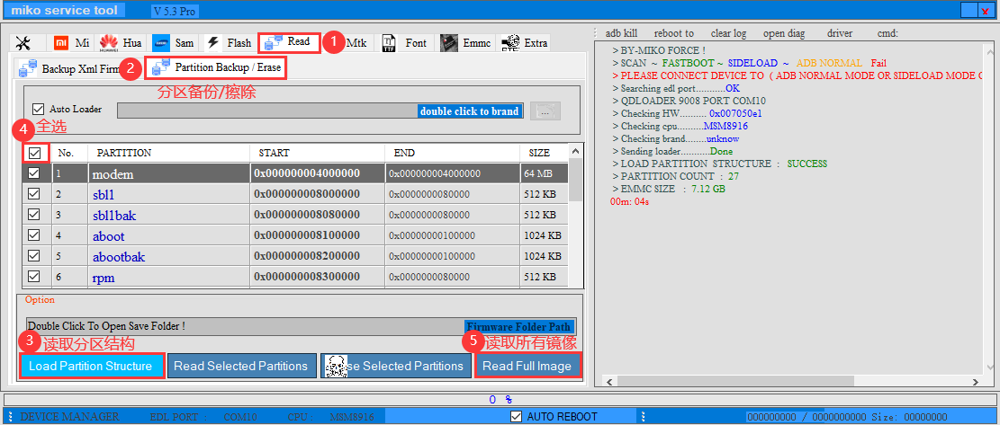
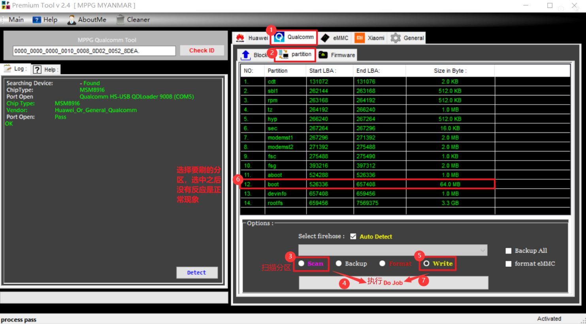

<h1 align="center">新讯 WR800 随身wifi固件</h1>

    
    
    
    
    
    

<!-- Start of Selection -->
## 设备信息
- **品牌**：新讯 WR800 （黑色）
- **板子型号**：MF32T_MB_V01
- **CPU芯片**：高通 410 （msm8916）msm8916_32_512
- **WiFi 密码**：12345678
- **Web 管理密码**：admin
- **切卡密码**：admin
- **Root 状态**：已获取
- **ADB 状态**：已开启
    

   
   

## 目录详情
- **APP**：存放常用刷机后用的应用程序。
- **驱动工具**：请先安装 `9008drive.exe`，其他工具可自行选择安装。
- **完整固件**：存放完整固件，方便下载。
## MiKo和boot.img，system.img固件在网盘里面
因为固件太大，无法上传，请自行下载。
https://www.123865.com/s/dgXbjv-9Sgfd?  提取码:6666
## 更新日志
- 2024-10-15：上传全量备份包，如果忘记备份可以全量恢复，已经root和安装了所有需要的app。
- 2024-10-12：线束各种重启问题，欠费重启，强行飞行，等。
- 2024-10-10：删除一些限速问题，（还在找其他限速后门）
- 2024-10-05：删除硬控后门，强制更新后门，系统更改后门，
- 2024-10-03：修改了ARDC投屏分辨率问题，默认是132x132，改成216x384，反编译boot.img
- 2024-10-02：添加控制脚本，脚本位置在/data/adb/service.d/enable_wifi.sh
- 2024-09-29：修改web后台管理密码为admin，修改切卡密码为admin。
- 2024-09-28：修改boot和system分区，开启root，adb，安装了面具，es文件浏览，ARDC投屏。
## 刷机原因
新买的随身wifi，存在限速、切卡、掉线等问题，且由于 boot 中存在强空，设备价格仅为 15 元，使用高通 410 芯片，性价比高。

## 刷机前注意事项
1. 使用螺丝刀打开随身WiFi，确认板子上型号是否为 MF32T_MB_V01。如果不是该型号，请勿刷机。
2. 刷机前请务必备份，以避免刷错。

## 备份设备
1. 安装 `9008drive.exe`，一路点击“下一步”即可。
2. 进入 9008 模式：
   - 先断开 USB，取下电池，找到板子上的 fb 位置（仔细查看，在板子边缘），共有 4 个金点。用镊子按住中间 2 个金点，然后插入 USB，数到3，即可进入 9008 模式。右键点击“我的电脑” - “管理” - “设备管理器” - “端口（COM 和 LPT）”查看是否成功。

3. 备份设备固件，保存为 bin 格式：
   - 打开 Miko，（文件太大，我放在网盘里面了）按照图示流程备份您的随身WiFi。备份默认bin格式就可以。
    

   
   

## 刷机步骤
1. 在网盘下载固件，并将下载的固件放在一个英文目录中。
2. 进入 9008 模式。
3. 打开 Qualcomm Premium Tool，记住一定要注册，查看流程：注册机-注册机使用教程.txt
4. 先读取设备分区，选择boot分区点写入，在选择system分区，在点写入。
5. 记住选择还原分区不要选错，不然会变砖。
   

   
   

## 常见问题
- **（Miko Service Tool）和（Qualcomm Premium Tool）提示：fail**
  1. 主要原因是 9008 被占用，需要重新插拔数据库或更换 USB 接口。
  2. 如果更换数据线、插拔 USB 口后仍然不行，可能是系统问题。我的笔记本因系统不兼容，折腾了很久，最后重装系统。如果无法解决，可以去网吧或借用朋友的电脑。我使用的是 Windows 10 64 位专业版。
  3. 如果更换后仍然不行，可能是电脑硬件问题。大部分情况下更换硬件后会成功。
- **9008怎么都进不去**
  1. 先检查驱动，是否正确安装。
  2. 换数据线或者镊子，或者换电脑。
  3. 用镊子按住主板上FB位置中间的两个小圆点，然后插上USB，数到3，即可进入9008。
- **enable_wifi.sh 问题**
  1. 这个脚本的作用是开机自动启动热点，usb网络共享，关闭4G网络在开启。
  2. 脚本位置在/data/adb/service.d/enable_wifi.sh
  3. 如果脚本有问题，请自行修改。或删除，删除命令是rm -rf /data/adb/service.d/enable_wifi.sh
  4. 删除需要进入adb shell，输入命令：rm -rf /data/adb/service.d/enable_wifi.sh
  5. 如果你发现网盘里面没有脚本，或者备份里面没有脚本，说明我已经不在需要脚本也一样能开启热点共享了
- **网速问题**
  1. 我反编译了大部分限速，如果速度还是不行，可能你是esim卡运营商限制
  2. 主板自带esim速度非常差，官方说是信号问题，其实就是终端限制了，这个没办法改
- **关于免流**
  1. 我没玩过，所以没有免流脚本，如果需要免流，请自行查找。
- **自带的seim卡限速问题**
  1. 大部分限速我都删除了，但是自己的上网卡，限速，没办法搞定，是网通哪里限速的。
## OpenWRT 和 Debian
使用了多个版本的 OpenWRT，调试解调器时提示失败，尝试更换各种文件仍然无效。待有新固件时，我会上传，目前没有支持的好用版本，只能耐心等待，时间有限，无法继续折腾。